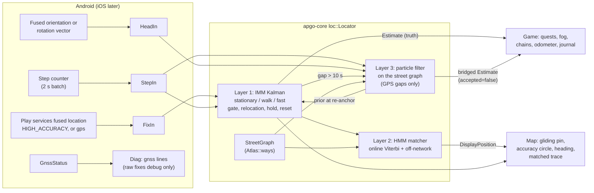

# Location quality program (issues #83 to #88, tracker #89)

## Goal

Top-tier location accuracy and feel on any Android phone, and later on iOS over the same Rust core. The game is GPS-first: every
quest, the fog, the odometer and the map marker depend on where the player is. Today that position is the raw fix, checked by
ad-hoc rules (accuracy 35 m, implied speed 100 km/h, 3 outliers in a row are believed, a 6 m odometer wobble anchor). This
program replaces those rules with a layered estimator built on standard methods: an IMM Kalman filter (one source of truth for checks
and the map), HMM map matching (only for what the map shows), and a path-constrained particle filter that bridges GPS gaps with steps
and heading. A record and replay bench measures each layer before and after it changes.

Success means:

- standing still makes the marker sit still (no jitter, no distance added) and walking makes it glide along the street;
- a single bad fix never completes or blocks a quest, and a real relocation is believed within about 3 fixes;
- arrival at a 25 m target is detected no more than 3 s after the truth (synthetic) or the reference track (real walks);
- the same behaviour on a phone without Google Play services, and a written plan that gives the same on iOS;
- every number above is checked by CI on synthetic walks and can be measured on a real walk with one command.

Everything ships in **one PR** (`feat/location-quality`), built as the sequenced tasks at the end of this spec.

## Decisions

Owner decisions of 2026-10-08 are binding (marked "owner"); the rest were made while writing this spec (marked "spec"). The open
questions were settled by the owner the same day and are folded in below.

| Topic | Decision | By |
| --- | --- | --- |
| Scope | #83 bench, #84 estimator, #85 best request on every phone, #86 marker, #87 map matching, #88 gap bridging, plus `ef927d8` (HIGH_ACCURACY) | owner |
| Architecture | IMM Kalman (truth) -> HMM matcher (display) -> particle filter (gaps only) | owner |
| What quests use | The IMM estimate: pickups, reach, dwell, away, fog, chains, odometer, near-miss diagnostics. Never raw fixes, never the matched position | owner |
| Smoothing | Adapts by speed and mode: heavy with a stationary hold when slow, light at speed | owner |
| Raw tracks | Recorded in debug builds only; release never stores raw fixes (the journal stores estimates) | owner |
| Filter state | Not saved. Restart = fresh filter. Saved games load unchanged. Quest radii unchanged | owner |
| iOS | No app yet: shared core plus the integration section below, no Swift code | owner |
| Raw GNSS measurements | Out of scope | owner |
| Where the estimator lives | `apgo-core` module `loc` (`core/src/loc/`), owned by `Game` as a `#[serde(skip)]` field, so Android and iOS get it through the same FFI | spec |
| Linear algebra | Hand-rolled fixed-size 2x2 / 4x4 math in `loc/mat.rs` (Joseph-form update), no new crate | spec |
| Frame | Local east-north (ENU tangent plane) around an anchor; re-anchored when the estimate is 5 km from it | spec |
| Timestamps | The fix's own time (`Location.time`, corrected by `elapsedRealtimeNanos`), not `now()` at delivery; out-of-order or duplicate fixes are dropped | spec |
| Sample rate | InZone while playing: 1 s while the screen is on, 5 s while it is off; HIGH_ACCURACY in both (decided in `GpsPolicy.forDecision`, unit-tested) | owner |
| Journal | Stores accepted estimates (throttled to 5 s or 5 m), not raw fixes; old raw rows stay | spec |
| Map pin | MapLibre `LocationComponent` in custom-location mode (we push estimates, it animates), drawables rendered by `MapMarkers`, colours from `ApgoPalette` | spec |
| Map matching input | IMM estimates (not raw fixes), display and trace only | spec |
| Street graph | Scans record simplified way geometry with shared nodes (`Atlas::ways`); older atlases get a degraded graph from `street_runs` | spec |
| Gap bridging | Walk and Run only (steps exist). Bike and Drive coast on the Kalman prediction for at most 30 s | spec |
| Bridged positions | Display, fog and Cartographer squares only; never quests, chains other than Cartographer, the odometer or the journal (`accepted = false`) | owner |
| Step length | Cadence model times a calibration saved on the phone in app preferences (not the game save), keyed by step source; re-validated against good GPS every session and adapting fast after a carry change | owner |
| Step source | Only the phone's `TYPE_STEP_COUNTER` (key `phone.step_counter`). The app never reads watch steps, so a forgotten watch changes nothing. A future Health Connect or watch source gets its own key and calibration | owner |
| Carry offset | A phone in a pocket or bag does not point where the player walks: the offset between device heading and GPS course is estimated online with a confidence, applied during gaps, and ignored (last course plus the street graph instead) when the confidence is low | owner |
| Map heading arrow | Course when moving; compass only when standing still with the phone held and the compass steady; otherwise no arrow | owner |
| Real walks in CI | Never committed (they show the owner's home). CI runs synthetic walks; real walks run locally | spec |
| No Play services | ~~Detected by package; then the `gps` provider is used directly and our filter does the fusion. No Play services library is added~~ Superseded 2026-10-09 by the next row. Without Play services the `gps` provider is used directly and our filter does the fusion | spec |
| Play services (2026-10-09) | Platform services first, ours on top: `play-services-location` is added (Android SDK licence, proprietary, accepted; Gradle deps are outside `cargo deny`). Detected by `GoogleApiAvailability` `SUCCESS` and the package enabled; then `FusedLocationProviderClient` gives fixes on every Android version and the Fused Orientation Provider the compass while the map is on screen. iOS likewise: Core Location and `CLHeading` first | owner |
| Simulated fixes (dev simulator) | Bypass the filter: each one resets it to an exact estimate (3 m), as today's teleports | spec |

## Architecture



| Layer | Purpose | Feeds | Never feeds |
| --- | --- | --- | --- |
| 1 IMM Kalman | Best estimate of position, velocity and motion state | Quests, fog, chains, odometer, journal, near-miss, map (when unmatched) | |
| 2 HMM matcher | Which street the player is on, how sure | Map pin (when confident), trace line, diag | Quests |
| 3 Particle filter | Position during a GPS gap from steps and heading on the street graph | Map pin, fog and Cartographer squares, IMM prior at re-anchor | Quests, other chains, odometer, journal |
| Bench | Record, replay, score | Parameter tuning, CI thresholds | Release builds (recording) |

## Layer 1: IMM Kalman filter (#84)

### State and models

State per model: `x = [e, n, ve, vn]` (metres and m/s in the local ENU frame), covariance `P` (4x4). Three models share the state so
mixing is exact.

| Model | Transition `F` over `dt` | Process noise `Q` |
| --- | --- | --- |
| S stationary | position kept, velocity set to 0 | position random walk `q_s = (0.05 m)^2 / s`, velocity variance `(0.1 m/s)^2` |
| W walking (Walk, Run) | constant velocity | white-noise acceleration, `sigma_a` = 0.5 m/s^2 (Walk zone), 1.0 (Run zone) |
| F fast (Bike, Drive) | constant velocity | white-noise acceleration, `sigma_a` = 1.5 m/s^2 (Bike), 3.0 (Drive) |

Constant-velocity noise (per axis): `Q = sigma_a^2 * [[dt^4/4, dt^3/2], [dt^3/2, dt^2]]`. All three models exist in every game;
the zone's travel mode picks `sigma_a` and the transition priors, so a walker who gets on a bus is still tracked (and `speed_ok`
then stops the checks, as today).

The **mode** is the travel mode of the zone that contains the estimate; outside every zone it is the fastest mode among the game's
zones (so a cyclist between zones is never gated as a walker).

### Measurement

| Input | `z` | `R` | When |
| --- | --- | --- | --- |
| Position | `[e, n]` of the fix | `sigma^2 I`, `sigma = max(2 m, accuracy_m / 1.515)` | every fix |
| Velocity | `[ve, vn]` from speed and bearing | along-track `speed_acc^2`, cross-track `(speed * sin(bearing_acc))^2`, rotated to ENU | fix has speed, speed accuracy and bearing accuracy, speed >= 0.5 m/s |
| Step evidence | (model likelihood factor, not a Kalman update) | S likelihood x 0.1 when >= 2 new steps in the last 5 s; W likelihood x 0.3 when 0 steps in the last 10 s (Walk/Run only) | each fix, if a step counter exists |

Android's `accuracy` is the 68 % horizontal radius; for a circular 2-D Gaussian that radius is 1.515 sigma per axis, hence the
divisor. iOS `horizontalAccuracy` is treated the same way.

### IMM cycle (per fix)

1. **Mix**: `mu_j|i` from the transition matrix `Pi(dt)` and model probabilities `mu`; mixed initial states and covariances.
2. **Predict** each model over `dt` (capped at 10 s per step; longer gaps are predicted in 10 s steps).
3. **Gate** (below). A gated fix stops here: models keep their prediction, `accepted = false`.
4. **Update** each model (Joseph form), likelihood `L_j = N(y; 0, S_j)` times the step evidence factor.
5. **Model probabilities** `mu_j ∝ L_j * c_j`, floor 1e-4 each.
6. **Combine**: output `x = sum mu_j x_j`, `P = sum mu_j (P_j + (x_j - x)(x_j - x)^T)`.

`Pi(dt)`: off-diagonal per-second rates times `min(dt, 10)`, the diagonal is the remainder.

| Per second, Walk / Run zones | to S | to W | to F |
| --- | --- | --- | --- |
| from S | 0.95 | 0.048 | 0.002 |
| from W | 0.05 | 0.94 | 0.01 |
| from F | 0.02 | 0.08 | 0.90 |

| Per second, Bike / Drive zones | to S | to W | to F |
| --- | --- | --- | --- |
| from S | 0.93 | 0.02 | 0.05 |
| from W | 0.05 | 0.80 | 0.15 |
| from F | 0.04 | 0.01 | 0.95 |

Initial state on the first fix (and after every reset): `x = [z, 0, 0]`, `P = diag(sigma^2, sigma^2, v0^2, v0^2)` with `v0` = 2 m/s
(Walk/Run) or 10 m/s (Bike/Drive); `mu = [0.6, 0.35, 0.05]` (Walk/Run) or `[0.4, 0.1, 0.5]` (Bike/Drive).

### Gating, outliers and relocation (replaces the jump rules)

| Rule | Value |
| --- | --- |
| Unusable fix (dropped before the filter, logged) | accuracy > 100 m, `t <= last t`, lat/lon out of range, NaN |
| Innovation distance | `d2 = y^T S^-1 y`, taken as the minimum over the three models' predictions |
| Hard gate | `d2 > 13.8` (chi-square, 2 dof, 99.9 %) -> gated; 18.5 when the velocity measurement is included (4 dof) |
| Soft gate | `9.21 < d2 <= 13.8` -> accepted with `R` inflated by `d2 / 9.21` (robust, Huber-like) |
| Relocation | 3 consecutive gated fixes that agree with each other (each pair within `acc_i + acc_j + v_max * dt`, `v_max` = 1.5 x the mode cap) and span >= 2 s, or any 2 such fixes with accuracy <= 20 m after 20 s of continuous gating -> reset at the newest, verdict `Relocated` |
| Reset | gap > 5 min since the last accepted fix, counting switched off or on, game opened, or `P` trace above (200 m)^2 |
| Reset effect on quests | Dwell and Away timers pause (as on a counting toggle); progress is kept |

### Stationary hold and adaptive smoothing

Smoothing strength comes from the model probabilities rather than a hand-tuned blend:

| Situation | Behaviour |
| --- | --- |
| `mu_S > 0.8`, speed < 0.3 m/s, no new steps for 10 s | **hold**: output position frozen; it moves only after 2 consecutive accepted fixes each > `max(3 m, 2 sigma_out)` from it; odometer adds 0 |
| Walking | W dominates: `sigma_a` 0.5 m/s^2 gives roughly 2 to 4 s of effective lag at 1 Hz |
| Bike, drive | F dominates: `sigma_a` 1.5 to 3 m/s^2, close to the raw fix at speed (light smoothing) |

### Outputs

```rust
pub struct Estimate {
    pub t_ms: i64,
    pub lat: f64, pub lon: f64,
    pub uncertainty_m: f64,      // 68 % radius: 1.515 * sqrt(largest eigenvalue of the position block of P)
    pub speed_mps: f64,
    pub speed_sigma_mps: f64,
    pub course_deg: Option<f64>, // from velocity, when speed >= 0.8 m/s and course sigma < 25 degrees
    pub motion: Motion,          // Stationary | Walking | Fast (largest mu)
    pub mode_probs: [f32; 3],
    pub source: Source,          // Gps | Bridged | Predicted
    pub verdict: Verdict,        // Used | Soft | Gated | Blurry | Relocated | Reset | Unusable
    pub accepted: bool,          // may complete or advance a quest
}
```

`accepted` is true when the verdict is `Used`, `Soft`, `Relocated` or `Reset`, the source is `Gps`, and `uncertainty_m <= 35 m`
(`MAX_UNCERTAINTY_M`, the old `MAX_ACCURACY_M` value, now applied to the estimate).

## Layer 2: HMM map matching (#87)

Newson and Krumm (2009), run online on IMM estimates, with an explicit off-network state. Display and confidence only.

### Street graph

| Item | Design |
| --- | --- |
| Source | New `Atlas::ways: Vec<WayGeom>` recorded by a scan from the Overpass `out geom` it already fetches: Douglas-Peucker simplified (2 m), with way class bits (foot, bike, car) |
| Topology | Vertices with identical coordinates (rounded to 1e-7 degrees) are one node, which is how OSM shares intersection nodes |
| Graph | `loc::StreetGraph`: nodes, directed edge pairs with length, an R-tree-like grid (reuse the `PathIndex` bucket idea, 30 m cells) of edges |
| Which edges | Edges allowed for the zone's mode (Walk/Run: all walkable incl. footways and crossings; Bike: no stairs/foot-only; Drive: car only), built for all zones of the game in `Game::attach_streets` |
| Old atlases (no `ways`) | Degraded graph from `street_links` with run ends joined to nodes within 12 m. Matching confidence is capped at 0.5 (so the pin stays unmatched) and `Atlas::needs_rescan()` also reports a missing `ways` |
| Size | About 5000 vertices for a 2 km radius zone (about 150 kB JSON). Built once on open |

### Model

| Part | Formula / value |
| --- | --- |
| Input | An IMM estimate when it moved >= 5 m from the last matched input or 5 s passed; nothing while `Motion::Stationary` (the matched state freezes) |
| `sigma_z` | `max(4.07 m, uncertainty_m / 1.515)` (N&K's 4.07 m as the floor) |
| Candidates | Projections onto edges within `min(50 m, 3 sigma_z + 10 m)`, at most 8 (nearest first), plus the off-network state |
| Emission (street) | `p = exp(-0.5 (d / sigma_z)^2) / (sqrt(2 pi) sigma_z)`, `d` = distance to the projection |
| Emission (off-network) | the street formula at `d = 20 m` (a street candidate closer than 20 m beats it) |
| Transition (street to street) | `p = exp(-abs(d_gc - d_route) / beta) / beta`, `d_gc` between the two inputs, `d_route` along the graph (bounded Dijkstra to `2 d_gc + 50 m`, else 0) |
| `beta` | 5 m default (N&K estimate it from the median of `d_t`; implementations use 3 to 10 m); tuned on the bench |
| U-turn | Reversing on the same edge x 0.2 unless speed < 0.5 m/s |
| On/off network | street to off 0.02 per second, off to street 0.05 per second (times `dt`, capped at 0.5); off to off 1 minus that |
| Decoding | Log-space online Viterbi. The pin uses the best current state (lag 0); the trace uses a fixed lag of 3 inputs |
| Break | All candidates impossible -> restart the lattice at this input |
| Confidence | Normalised forward probability of the chosen state, 0..1 |

### Display rule

The pin is drawn at the matched point when confidence >= 0.7 and it is within `max(10 m, 2 sigma_out)` of the estimate; otherwise
at the estimate. Switches between the two glide like any other move (see Display), never jump.

## Layer 3: particle filter for GPS gaps (#88)

| Item | Value |
| --- | --- |
| Starts | No accepted fix for 10 s while steps keep arriving (Walk/Run zones, step counter present) |
| Ends | The next accepted fix (re-anchor), 5 min of bridging (then a reset, like a gap), or 30 s with no steps (then `Predicted`, uncertainty growing) |
| Particles | 300, seeded RNG (deterministic replay) |
| Particle state | edge, offset, direction, step-length scale `s ~ N(1, sigma_k)` (`sigma_k` from the calibration, at least 0.05), heading bias `b ~ N(0, 10 deg)`; 10 % of particles are off-network (2-D position) |
| Initialisation | Sample from the IMM `N(x, P)` at the gap start, project to edges within `3 sigma`, weight by the HMM emission; inherit the HMM's current edge when it is confident |
| Step length | `L = clamp(0.25 + 0.25 f, 0.5, 1.1) m`, `f` = cadence in steps/s (1.8 -> 0.70 m, 2.8 -> 0.95 m), times `k_user` (step calibration below) |
| Heading used | `theta = azimuth + delta` when the carry-offset confidence `c >= 0.5`; otherwise the last good GPS course with a growing sigma and the street graph (carry-offset estimator below) |
| Propagate | Per step batch: move `steps x L x s` along the edge; at a node pick the outgoing edge with weight `exp(-dtheta^2 / (2 sigma_theta^2))`, `dtheta` = edge bearing minus (`theta` + particle bias `b`) |
| Weights | Heading likelihood with `sigma_theta` from the estimator below; off-network particles have 0.5 x weight |
| Resampling | Systematic when `N_eff < N / 2`; roughening 1 m along the edge |
| Output | Weighted mean of the heaviest edge cluster; `uncertainty_m` = 1.515 x weighted spread; `source = Bridged`, `accepted = false` |
| Re-anchor | The particle cloud is moment-matched to a Gaussian and becomes the IMM prior; the fix is gated against it (a gated fix goes to the relocation rule) |
| Bike / Drive | No particles: Kalman prediction for at most 30 s (`source = Predicted`), then the position is stale |

What bridged positions feed (owner, 2026-10-08): the map, **fog** and **Cartographer squares** (`Fog::cells`, so the Cartographer
chain counts them). Nothing else: no quest tracker, no other chain, no odometer and no journal point. On re-anchor the odometer adds
the straight line from the last accepted estimate to the anchoring fix, as for any accepted fix after a gap under 5 min.

### Step calibration (saved on the phone)

| Item | Design |
| --- | --- |
| Where | App preferences (`SharedPreferences` `stepcal`; `UserDefaults` on iOS), never the game save, one entry per step source |
| Key | Step source id: today always `phone.step_counter` (Android `TYPE_STEP_COUNTER`; iOS `CMPedometer` is `phone.pedometer`). A future Health Connect / watch source gets its own key |
| Value | `k` (scale on the cadence model), `var_k`, `samples`, `updated_ms` |
| Default | `k = 1.0`, `var_k = 0.15^2` |
| Measurement | Sliding 20 s windows of walking with `uncertainty_m <= 10`, IMM distance `d >= 30 m`: `k_obs = d / sum(L(f))`, `sigma_obs = 2 x mean uncertainty / d` |
| Update | 1-D Kalman on `k`: process noise `(0.01)^2` per minute of walking; clamp 0.6..1.4 |
| Re-validate each session | For the first 3 min of walking in a session `var_k` is raised to at least `0.1^2`, so the stored value is checked against GPS, not trusted blindly |
| Fast adapt (carry change) | Two windows in a row with `abs(k_obs - k) > 3 sqrt(var_k + sigma_obs^2)`, or a cadence jump of more than 20 % at the same GPS speed: `var_k = 0.2^2` (the next windows dominate); hand, pocket and bag give different step signals |
| Saved | On game close, app background and every 5 min while walking; loaded on game open (`Engine::set_step_calibration`) |
| Not filter state | The filter itself still starts fresh on every restart; only this device-level number persists |

### Carry offset (device heading vs walking direction)

A phone in a pocket or bag points anywhere, so the raw compass is wrong for PDR. The offset `delta = wrap(course - azimuth)` is
estimated online, per session (it changes whenever the phone moves), with a confidence.

| Item | Design |
| --- | --- |
| Learn when | GPS good: `uncertainty_m <= 10`, speed >= 0.8 m/s, course sigma <= 15 deg, and the compass steady (azimuth rate < 30 deg/s over 2 s, so a swinging hand is not learned) |
| Estimator | 1-D circular Kalman on `delta`: measurement sigma = `sqrt(course_sigma^2 + compass_sigma^2)` (compass sigma 15 / 30 / 45 deg for high / medium / low sensor accuracy), process noise `(2 deg)^2` per s |
| Steadiness | Mean resultant length `R` of the last 20 s of residuals; `R < 0.6` means the offset is not stable (phone swinging): confidence 0 |
| Carry change | Innovation > 3 sigma for 3 s while learning, or an azimuth jump > 45 deg within 2 s with the cadence unchanged during a gap: `var_delta` reset to `(90 deg)^2`, confidence 0 until re-learned |
| Confidence | `c = clamp(1 - sigma_delta / 45 deg, 0, 1) x (R >= 0.6 ? 1 : 0)` |
| Gap, `c >= 0.5` | `theta = azimuth + delta`, `sigma_theta = sqrt(sigma_delta^2 + compass_sigma^2)` |
| Gap, `c < 0.5` | Compass ignored: `theta` = last good GPS course, `sigma_theta = min(10 deg + 2 deg/s x gap time, 90 deg)`; at a node the straight-on edge is preferred and the street graph does the rest |
| Hand-held (screen on, phone flat-ish) | The same estimator; the offset is then near 0 with high confidence, so nothing special is needed |

## Display (#86)

| Element | Design |
| --- | --- |
| Pin | MapLibre `LocationComponent`, `useDefaultLocationEngine(false)`, fed with `forceLocationUpdate` from `Engine::position()` after every fix, step batch and heading change |
| Glide | The component interpolates between pushed positions over the update interval (about 1 s); a jump > 50 m (reset, relocation) snaps instead |
| Accuracy circle | `uncertainty_m` of the shown position (estimate, matched or bridged), colour `ApgoPalette.me` at low alpha; hidden under 3 m |
| Heading arrow | Course when moving (`course_deg` present), including bridged stretches (the particle cloud's direction). Compass azimuth (true north via `GeomagneticField` declination) only when standing still with the phone held: app visible, screen on, phone within 60 deg of flat, sensor accuracy medium or better, azimuth spread < 10 deg over 2 s. Otherwise no arrow (an unreliable compass is dropped, not shown) |
| Bridged / stale | Pin drawn hollow (bridged) or greyed (stale > 30 s), so the player sees it is a guess |
| Drawables | New `MarkerSpec.Me(heading: Boolean, state)` rendered by `MapMarkers.render`, icons from `ApgoIcons` (`Me`, a new `Heading`), colours from `ApgoPalette` (`me`, new `meUncertain`) |
| Trace | `TRACE` layer draws the matched line (fixed lag) where confident, else the estimate line |
| Camera | Unchanged (follow is out of scope) |
| Text | Any new help text ("Why is my dot hollow?") lives in `ui/HelpText.kt` |

The old `MapSource.ME` badge layer is removed once the component draws the pin.

## Best location request on every phone (#85)

| Phone | Request | Notes |
| --- | --- | --- |
| Android 8+, Play services present (superseded 2026-10-09: was `LocationManager` `fused` on 12+) | `FusedLocationProviderClient`, `PRIORITY_HIGH_ACCURACY`, `setWaitForAccurateLocation(true)`, `GRANULARITY_FINE`; screen on: `Builder(1000)`, min interval 1000, no batching; screen off: `Builder(5000)`, `setMaxUpdateDelayMillis(10000)`; cold start `getCurrentLocation` (max age 2 min) | `GpsPolicy.gmsRequest`, `gmsColdStart`; a failed request falls back to the rows below until the next game open |
| Android 12+, no Play services (GrapheneOS, LineageOS without GMS, Huawei) | `gps` provider, same builder; `network` only for the first (cold-start) fix with `R` x 4, never mixed once GNSS fixes arrive | AOSP's fused provider just picks between gps and network; our filter does the fusion |
| Android 8 to 11, no Play services | `gps` provider, `requestLocationUpdates(gps, 1000 or 5000, 0f)` (screen on / off) | as today, faster with the screen on |
| Outside zones / idle | unchanged (`PresencePolicy` 90 s, idle 15 s / 20 m, BALANCED) | |

**Rate decision** (`GpsPolicy.forDecision(d, appVisible, screenOn)`, pure, unit-tested): InZone and screen on = 1000 ms, InZone and
screen off = 5000 ms, both `highAccuracy = true` and `minDistanceM = 0`; OutsideZones, Stopped, AtHome and InCar unchanged.
`PresencePolicy` keeps deciding the state; `GpsPolicy` picks the interval from it and the screen. `Sensors.startLocation` already
ignores a repeated identical rate, so a screen on/off broadcast (`ACTION_SCREEN_ON` / `OFF`) simply re-applies the decision. Tests:
the four InZone x screen combinations (with app visible or not), OutsideZones ignoring the screen, Stopped visible vs not, and that
the chip never drops to BALANCED inside a zone.

| Item | Design |
| --- | --- |
| GMS detection | `PackageManager.getApplicationInfo("com.google.android.gms").enabled` and `GoogleApiAvailability.isGooglePlayServicesAvailable == SUCCESS` (superseded 2026-10-09: was the package plus `"fused" in lm.allProviders`, which excluded Android 8-11 phones with Play services). Pure function `GpsPolicy.providers(enabled, gms)` (unit-tested) |
| Batched delivery | Handle `onLocationChanged(List<Location>)`, oldest first |
| Fix fields sent | lat, lon, time, `elapsedRealtimeNanos`, accuracy, speed + accuracy, bearing + accuracy, altitude + vertical accuracy, provider, `isMock` (API 31) / `isFromMockProvider` |
| Mock locations | Real builds: a mock fix is `Unusable` (logged). Debug builds may allow it (setting) for the bench |
| GNSS status | `GnssStatus.Callback` while playing: a `gnss` diag line every 10 s (satellites in view / used per constellation, mean C/N0 of the top 4, bands seen: L1, L5/E5a from `getCarrierFrequencyHz`). Once per session: `getGnssHardwareModelName`, `GnssCapabilities` (API 31+), dual-frequency seen yes/no. All builds (no positions in it) |
| Steps | Phone `TYPE_STEP_COUNTER` only (no watch or Health Connect steps), batch 2 s while InZone (today 10 s), event timestamp (`SensorEvent.timestamp`) sent, so cadence is known |
| Step calibration | Loaded from preferences `stepcal` on game open (`Engine::set_step_calibration`), saved from `Engine::step_calibration()` on close, background and every 5 min |
| Heading | With Play services and the map on screen: the Fused Orientation Provider (true north, `headingErrorDegrees` as `HeadingIn.error_deg`; foreground only). Otherwise `TYPE_ROTATION_VECTOR`. 200 ms on screen, 1 s off, while InZone; sent with azimuth, sensor accuracy (`onAccuracyChanged`) and pitch/roll (so the core knows whether the phone is held flat) |
| Battery guidance | New optional step in `SetupFlow` ("Keep tracking alive") shown when `isIgnoringBatteryOptimizations` is false: OEM-specific text by `Build.MANUFACTURER` (Samsung, Xiaomi, Huawei/Honor, OnePlus/Oppo/Realme, other) in `HelpText.kt`, a button opening `ACTION_IGNORE_BATTERY_OPTIMIZATION_SETTINGS` (the settings list, not the direct request intent) |

## iOS integration plan (no Swift in this PR)

| Concern | iOS API | Maps to |
| --- | --- | --- |
| Accuracy while playing in a zone | `CLLocationManager.desiredAccuracy = kCLLocationAccuracyBestForNavigation`, `distanceFilter = kCLDistanceFilterNone` | Android HIGH_ACCURACY, 1 s |
| Activity type | `.fitness` for Walk/Run zones, `.otherNavigation` for Bike and Drive; never `.automotiveNavigation` (Core Location road-snaps it before our filter; changed 2026-10-09) | mode |
| Background | `allowsBackgroundLocationUpdates = true`, `UIBackgroundModes: location`, `showsBackgroundLocationIndicator = true`, `pausesLocationUpdatesAutomatically = false` (iOS 17+: `CLBackgroundActivitySession` plus `CLLocationUpdate.liveUpdates(.fitness)` is the modern equivalent) | foreground service |
| Precise location | If `accuracyAuthorization == .reducedAccuracy`: `requestTemporaryFullAccuracyAuthorization(withPurposeKey:)` while playing | fine location permission |
| Outside zones / home / car | `desiredAccuracy = kCLLocationAccuracyHundredMeters` or stop updates; presence rules stay in the host | `PresencePolicy` |
| Fix fields | `coordinate`, `timestamp`, `horizontalAccuracy`, `speed`, `speedAccuracy`, `course`, `courseAccuracy`, `altitude`, `verticalAccuracy`, `sourceInformation.isSimulatedBySoftware` | `FixIn` (negative values mean "unknown" on iOS: send `None`) |
| Steps | `CMPedometer.startUpdates(from:)`: `numberOfSteps` (cumulative since start, fine: the core uses differences), `currentCadence` | `on_steps` (cadence optional field) |
| Heading | `CLHeading` first (platform first, 2026-10-09): `startUpdatingHeading`, `trueHeading`, `headingAccuracy` (as `error_deg`), `headingFilter = 2` | `on_heading` |
| Motion hint | `CMMotionActivityManager`, optional soft prior on the IMM mode probabilities, never a hard switch | (no core API yet) |
| Core | Same UniFFI `Engine` (Swift bindings), same `Locator`, same parameters | |
| Display | MapLibre iOS `MLNUserLocationAnnotationView` driven by `Engine.position()`, same glide and circle rules | `LocationComponent` |

## Data flow and API

### Core types (`core/src/loc/`)

| File | Holds |
| --- | --- |
| `mod.rs` | `Locator` (facade: owns `Imm`, `Matcher`, `Bridge`, step and heading history), `RawFix`, `Estimate`, `DisplayPosition`, enums |
| `frame.rs` | ENU anchor, `to_enu` / `to_geo`, re-anchoring |
| `mat.rs` | 2x2 / 4x4 matrices, inverse, Joseph update |
| `imm.rs` | models, mixing, gate, hold, relocation, reset |
| `graph.rs` | `StreetGraph` from `Atlas::ways` (or degraded), edge grid, bounded Dijkstra with a small cache |
| `matcher.rs` | online Viterbi, candidates, off-network |
| `bridge.rs` | particle filter, step length, calibration |
| `params.rs` | `LocParams` (every number in this spec, `Default`, serde, loaded by the replay CLI from TOML) |
| `bench.rs` | metric functions shared by tests and the replay example; synthetic walk generator |

```rust
pub struct RawFix {
    pub t_ms: i64, pub lat: f64, pub lon: f64, pub accuracy_m: f64,
    pub speed_mps: Option<f64>, pub speed_acc_mps: Option<f64>,
    pub bearing_deg: Option<f64>, pub bearing_acc_deg: Option<f64>,
    pub altitude_m: Option<f64>, pub vertical_acc_m: Option<f64>,
    pub provider: Provider,   // Fused | Gps | Network | Ios | Sim | Other
    pub mock: bool,
}

impl Locator {
    pub fn new(params: LocParams) -> Self;
    pub fn set_mode(&mut self, mode: Mode);
    pub fn set_graph(&mut self, g: Arc<StreetGraph>);
    pub fn reset(&mut self);
    pub fn on_fix(&mut self, f: &RawFix) -> Estimate;
    pub fn on_steps(&mut self, total: i64, t_ms: i64, cadence: Option<f64>) -> Option<Estimate>; // Some while bridging
    pub fn on_heading(&mut self, h: &HeadingIn); // azimuth, accuracy, pitch, roll, t_ms
    pub fn set_step_calibration(&mut self, c: StepCal); // k, var_k, samples, updated_ms, source
    pub fn step_calibration(&self) -> StepCal;
    pub fn display(&self, now_ms: i64) -> Option<DisplayPosition>; // predicts at most 3 s ahead
}
```

### How `Game::on_fix` changes

`Game::on_fix(raw, steps)` becomes: `let est = self.locator.on_fix(&raw); self.on_estimate(&est, steps)`. `on_estimate` holds today's
body with these replacements:

| Today | Replaced by |
| --- | --- |
| `fix.accuracy_m > MAX_ACCURACY_M` -> `Verdict::Blurry` | `est.uncertainty_m > MAX_UNCERTAINTY_M` (35 m) -> `Blurry`; `Tracker::update` receives a `Fix` built from the estimate (`accuracy_m = uncertainty_m`) |
| `implied_speed_kmh` > `MAX_PLAUSIBLE_KMH` and `outlier_streak < MAX_OUTLIER_STREAK - 1` -> `Jump` | IMM gate (`Gated`) and relocation rule (`Relocated`); `implied_speed_kmh`, `MAX_PLAUSIBLE_KMH`, `MAX_OUTLIER_STREAK`, `outlier_streak` are deleted |
| `speed_ok(mode, implied speed)` | `speed_ok(mode, est.speed_mps * 3.6 - 2 * sigma)` (lower bound, so noise does not block a slow walker) |
| Odometer anchor (`ODOMETER_MIN_STEP_M`, wobble vs accuracy) | Sum of estimate increments while `motion != Stationary` and not holding; `ODOMETER_MIN_STEP_M` deleted; 5 min gap reset kept |
| `last_fix` (raw) as `last_pos`, `blocked_reason`, away accrual | last accepted estimate |
| Any accepted raw fix updates fog | any estimate with `source != Predicted` (bridged included: fog and Cartographer squares only) |
| Quest trackers on every non-blurry fix | only when `est.accepted` |
| `explain_near` reasons | from `est.verdict`: "GPS uncertain (41 m, needs 35 m)", "ignored as a GPS jump", "position estimated from steps (GPS gap)", plus today's other reasons |
| Simulated fix | `Locator::reset` then an exact estimate (3 m) |

`Game::set_counting`, `open`, and `attach_streets` call `locator.reset()` / `set_graph`. `Game::on_steps` also calls
`locator.on_steps` and, while bridging, feeds the bridged estimate to fog (and so Cartographer squares) and the display, never to
trackers, other chains, the odometer or the journal.

### FFI (`core/ffi/src/engine.rs`)

| Change | Shape |
| --- | --- |
| `on_fix` | `on_fix(fix: FixIn, steps: Option<i64>, simulated: bool) -> Vec<EventOut>`; `FixIn` mirrors `RawFix` (provider as a string) |
| `on_steps` | `on_steps(total, t_ms, cadence: Option<f64>)` |
| new `on_heading` | `on_heading(h: HeadingIn)`: `azimuth_deg`, `accuracy` (`high` / `medium` / `low` / `unreliable`), `pitch_deg`, `roll_deg`, `t_ms` |
| new step calibration | `set_step_calibration(c: StepCalIn)` and `step_calibration() -> StepCalOut` (`source`, `k`, `var_k`, `samples`, `updated_ms`); the host stores it |
| new `position` | `position(now_ms) -> Option<PositionOut>`: `lat`, `lon` (shown), `est_lat`, `est_lon`, `uncertainty_m`, `speed_mps`, `course_deg`, `heading_deg`, `heading_source` (`course` / `compass` / `none`, per the arrow rule in Display), `matched`, `match_confidence`, `source` (`gps` / `bridged` / `predicted` / `stale`), `age_ms`, `snap` (true after a reset or relocation: do not glide) |
| new `trace_matched` | the fixed-lag matched line for the current session (the journal keeps estimates) |
| journal | `add_point` stores accepted estimates (5 s or 5 m throttle); `fix_rejected` covers `Gated` and `Unusable` too (1 per minute, as today) |
| `zone_proximity` | takes the estimate (Kotlin passes `position()`) |
| diag (debug) | `Engine::set_record_raw(bool)`; when on, the core does nothing extra (recording happens in Kotlin, below) |

Android calls `position()` after `on_fix`, `on_steps` and `on_heading` and pushes it to the map; `AppModel.me` and
`PresenceController`'s home-Wi-Fi offer read `position()` instead of `realLoc`.

## Replay bench (#83)

### Recording (debug builds only)

A second `DiagLog` instance writes `diag/raw/raw-NNNN.jsonl` (10 x 2 MB, so it never pushes the normal diag out), only when
`BuildConfig.DEBUG`. Same line format as `DiagLog`:

| `tag` | Fields |
| --- | --- |
| `rawfix` | `tf` (fix ms), `ert` (elapsed ns), `lat`, `lon`, `acc`, `spd`, `spd_acc`, `brg`, `brg_acc`, `alt`, `valt`, `prov`, `mock` |
| `rawsteps` | `total`, `te` (event ms) |
| `rawhead` | `te` (sensor event ms, same clock as fixes and steps), `az`, `acc`, `pitch`, `roll`, `err` (fused orientation only) |
| `rawstate` | `presence`, `counting`, `zone` (proximity; Kotlin does not know the zone's mode, the replay takes `--mode`), `app_visible` on every change |

At 1 Hz that is about 0.7 MB per hour. `pull_diag.sh` already pulls `diag/` recursively; `diag_report.py` gains a section counting
raw lines and the gnss summary.

### Replay CLI

`cargo run --release --example replay -- <pulled-dir | raw.jsonl | journal.db> [--mode walk|run|bike|drive] [--params p.toml]
[--atlas realm-atlas.json ...] [--game games/<id>.json] [--geojson out.geojson] [--csv out.csv] [--compare baseline]`

- Reads `diag/raw/*.jsonl`; falls back to `journal.db` `points` (position, time, accuracy only), which is how the 2026-10-07 walk is
  replayed.
- Loads the atlases of the game's realms from the pulled `files/` (for the graph) and, with `--game`, the quests (for pickup hits).
- `--compare baseline` also runs today's rules (kept as `bench::LegacyRules`, test-only) and prints both columns.
- GeoJSON output: raw fixes, estimates, matched line, bridged stretches, gated fixes; opens in any viewer for a visual check.

### Metrics (scorecard)

Real walks have no ground truth, so the reference is the **RTS-smoothed** IMM track over the whole recording (forward-backward,
only fixes with accuracy <= 15 m). Synthetic walks use the truth.

| Metric | Definition |
| --- | --- |
| Stationary jitter | In stationary windows (>= 20 s without new steps, or truth speed 0): RMS distance of the shown position from the window's median, and shown path length per minute |
| False jumps | Consecutive shown positions whose displacement exceeds `max(15 m, 3 x (ref speed x dt + uncertainty))` while ref speed < 2 m/s |
| Arrival lag | For each target (the game's quests, plus virtual targets every 200 m on the reference): time from the reference entering the 25 m radius to the estimate entering it (negative = early) |
| Turn lag | At turns (ref course change > 60 deg within 10 m): time until the estimate's course is within 20 deg of the new course |
| Position error | RMS and p95 of estimate minus reference |
| Rejected fixes | Count and share per verdict (Gated, Soft, Blurry, Unusable, Relocated) |
| Pickup hits | Quest targets that complete with the filter vs the legacy rules: gained, lost, both |
| Matching | Share of time matched (confidence >= 0.7), edge switches per minute, off-network share |
| Bridging | Gaps bridged, error at re-anchor (distance from the bridged position to the first fix), re-anchor display jump |
| Cost | Mean and p99 time per `on_fix` (host CPU; the phone budget is below) |

### CI synthetic walks (`core/tests/loc_scenarios.rs`)

Generator: seeded truth trajectory on a small synthetic street grid; GNSS error = AR(1) correlated noise (time constant 30 s, sigma
from the scenario's accuracy) plus white noise, reported accuracy = 1.515 x sigma with +-30 % jitter, optional spikes, gaps and
steps (cadence 1.8 Hz). Each scenario runs 20 seeds; a threshold must hold on every seed unless the column says p90.

| Scenario | Thresholds |
| --- | --- |
| Straight walk, 1.4 m/s, 5 min, acc 5 m, 1 Hz | RMS error <= 3 m, p95 <= 6 m, false jumps 0 |
| 90 deg turn at a corner | turn lag <= 4 s, overshoot <= 8 m, matched edge correct within 5 s |
| Standing 5 min, acc 8 m, correlated drift | jitter RMS <= 2 m, shown drift <= 5 m/min, odometer gain <= 5 m, hold >= 95 % of the time |
| Single 150 m spike; 3-fix 80 m burst | spike and burst gated, shown deviation <= 3 m, no quest event |
| Real relocation (2 km in 60 s) | `Relocated` within 3 fixes or 15 s |
| 60 s GPS gap with steps along a street, then a turn | bridged error at re-anchor <= 15 m (p90), display jump at re-anchor <= 10 m |
| Phone in a pocket: 90 deg heading offset (learned on 2 min of good GPS), then a 60 s gap with a turn | offset learned to within 15 deg before the gap; bridged error at re-anchor <= 20 m (p90); the raw compass (no offset) must do worse, proving the offset is used |
| Pocket, carry change during the gap (offset jumps from 90 to 0 deg) | confidence drops; bridge falls back to course plus graph; error at re-anchor <= 25 m (p90) |
| Step length after a carry change (true scale 1.0 to 0.85) | calibration within 0.05 of the new scale after 2 min of good GPS |
| Bike 5 m/s with two 30 s stops | arrival lag <= 2 s at 25 m, held at both stops |
| BALANCED stress (acc 25 +- 15 m, 0.2 Hz) | zero completions of a 25 m target 60 m off the route; arrival lag at on-route targets <= 10 s (p90) |
| Walk-in arrival at a 25 m pickup | lag <= 3 s; a pass at 35 m never counts (all 20 seeds) |
| Mode mismatch (driving 50 km/h in a Walk zone) | tracked (no `Gated` streak > 3), `speed_ok` blocks checks |

The 2026-10-07 walk (median accuracy 5 m, 384 real points, 3.4 km) and the 2026-10-08 walk (BALANCED bug: median 24.9 m, 88
rejected) are scored locally with `--compare baseline` and the scorecards are pasted into the PR. The 2026-10-08 pull is not in
`diag/` of the main checkout yet: pull it (`scripts/pull_diag.sh`) before task 10.

## Performance budget (per phone)

Target: Pixel 8 Pro and a low-end reference (Cortex-A53 class). Measured by a `#[test] #[ignore]` timing harness on the host
(scaled) and by timing `on_fix` in debug builds on the phone (a `perf` field in the heartbeat: p50/p99 per minute).

| Work | Per call | Budget (A53, p99) |
| --- | --- | --- |
| IMM update (3 models, 4-state) | about 2 us | 50 us |
| HMM step (8 x 8 candidates, cached bounded Dijkstra) | about 300 us | 3 ms |
| Particle filter step batch (300 particles) | about 100 us | 1 ms |
| Whole `Engine::on_fix` incl. quests and journal | | 10 ms |
| Graph build on game open (all zones) | | 300 ms, off the main thread (as today's `attach_streets`) |
| Memory (graph + lattice + particles) | | 5 MB |

Calls stay on the existing background path; the UI thread only reads `position()`.

## Testing strategy

| Level | What |
| --- | --- |
| Unit (core, TDD first) | ENU round trip and re-anchor; matrix ops; each model's predict; gate thresholds at the chi-square boundaries; soft-gate inflation; relocation (3 consistent vs 3 scattered); reset triggers; hold enter/exit; step evidence; `Pi(dt)` rows sum to 1; graph from shared nodes and degraded graph; candidates, emission, transition, U-turn, off-network; Viterbi on a hand-built lattice; particle step, junction choice by heading, resampling; step calibration (clamp, session re-validation, fast adapt after a carry change, separate sources); carry offset (learning only when GPS and compass are good, steadiness, carry-change reset, low confidence falls back to course plus graph); compass arrow only when held, flat and steady; deterministic replay with a seed |
| Game (core) | Existing game tests move to `on_estimate` with exact estimates (the API changed; their expectations do not). The jump, outlier and accuracy tests move to `loc` tests against the new rules. New: a gated fix never completes a quest; bridged estimates add fog and Cartographer squares but no tracker progress, other chain, distance or journal point; a reset pauses dwell; counting toggle resets the filter |
| Scenarios (CI) | The table above, in `check-rust` |
| Property | `proptest`-style random fixes: no panic, `uncertainty_m` finite and > 0, probabilities sum to 1 |
| FFI | `FixIn` with all options `None`; `position()` before any fix is `None` |
| Android unit | `GpsPolicy.forDecision` rate table (InZone 1 s screen on / 5 s off, HIGH_ACCURACY both), `GpsPolicy.providers(enabled, sdk, gms)`, step calibration preferences round trip by source key, request builder choices, band classification from carrier frequency, OEM guidance picker, `PositionOut` to `Location` mapping, raw-line formatter |
| Device | One walk with the debug build: raw recording, scorecard vs baseline, screenshots of the pin standing still, walking, at a corner and in a gap; one run on the emulator with a GPX route |

Coverage floors only go up (`check-rust` 80 %).

## Migration and compatibility

| Area | Effect |
| --- | --- |
| Saved games | No change: the locator is `#[serde(skip)]`; quests, radii and counters untouched |
| Atlases | New `ways` field (`serde(default)`); old scans load and get the degraded graph; a rescan (cache hits) adds `ways` |
| Journal | Same schema; new rows are estimates. Old rows stay raw (the trace of an old game mixes both, fine) |
| FFI | `on_fix` / `on_steps` signatures change; Kotlin is the only caller and changes in the same PR |
| Behaviour players notice | Smoother pin and trace, fewer "ignored" fixes, arrival up to about 3 s later, standing still adds no distance |
| Raw tracks | Release builds stop storing raw fixes (the journal held them before) |

## Sequenced tasks (one PR)

| # | Task | Issues |
| --- | --- | --- |
| 0 | HIGH_ACCURACY while playing (done, `ef927d8`) | #85 |
| 1 | Android raw recording (debug), fix fields and timestamps, `onLocationChanged(List)` | #83 |
| 2 | `loc::bench` metrics, synthetic generator, `LegacyRules`, replay example; baseline scorecards of both real walks | #83 |
| 3 | `loc` frame, mat, IMM with gate, relocation, hold, reset; scenario tests | #84 |
| 4 | Wire `Locator` into `Game` (`on_estimate`), delete the old rules, FFI `FixIn`, journal stores estimates | #84 |
| 5 | Provider choice with and without Play services, `GpsPolicy` 1 s / 5 s by screen, batching, GNSS status diag, step batch 2 s, battery setup step | #85 |
| 6 | `position()`, LocationComponent pin, glide, accuracy circle, heading (course + compass) | #86 |
| 7 | `Atlas::ways` in scans, `StreetGraph` (incl. degraded) | #87 |
| 8 | HMM matcher, display rule, matched trace | #87 |
| 9 | Rotation vector, `on_heading`, carry-offset estimator, step calibration saved by source, particle filter bridge | #88 |
| 10 | Tune `LocParams` on the bench, record final scorecards, update thresholds only upward | all |
| 11 | Docs: a `docs/context/location-estimation.md` context doc, update `v1-architecture-and-status.md` | #89 |

## Risks

| Risk | Mitigation |
| --- | --- |
| Smoothing lag makes arrivals feel late | Arrival lag thresholds in CI; F model at speed; 1 s rate |
| Correlated GNSS error (multipath drift) is not white noise; the filter can be overconfident | AR(1) error in the synthetic walks; soft gate; uncertainty floor 2 m; tune on real walks |
| Reported accuracy differs by phone and provider | `R` from accuracy with a floor; bench per device; no-GMS path uses the raw `gps` accuracy |
| Hold swallows a slow real start | Exit after 2 consistent fixes; step evidence ends hold at once when steps arrive |
| Old atlases without `ways` match poorly | Confidence capped, display falls back to the estimate, rescan prompt |
| `LocationComponent` limits styling or interpolation | Fallback: our own GeoJSON layer animated with a frame clock (same `position()` input) |
| Heading in a pocket or bag is meaningless | Carry offset learned against GPS course with a confidence; low confidence uses the last course plus the street graph; pocket scenarios in CI |
| A wrong saved step length after a carry change | Re-validated every session and fast adapt on a large error |
| CPU on low-end phones | Budgets above, measured in the heartbeat; caps on candidates and particles |
| Spoofing through the bridge (shaking the phone) | Bridged positions never complete quests |
| One big PR is hard to review | Sequenced commits per task, each with its tests green |

## Out of scope

Raw GNSS measurements (`GnssMeasurement`, carrier phase, RTK), Activity Recognition as mode proof, camera follow/heading-up map,
saving filter state across restarts, watch or Health Connect steps, sharing raw tracks from release builds, iOS code, offline map-matching of old
journal tracks, and changing quest radii.

## Open questions

None. The three questions of the first draft were settled by the owner on 2026-10-08 (step calibration saved by source,
bridged positions feed only fog and Cartographer squares, 1 s / 5 s by screen) and are recorded in the decisions table.
